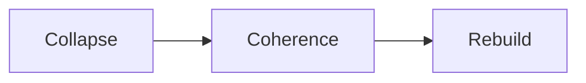

# Human OS Collapse Theory: CCRP Adaptation to the Merge Era

## Abstract
Human cognitive architectures evolved for relatively static social and institutional environments.  
Under conditions of recursive technological acceleration, these "operating systems" collapse without adaptive protocols.  

The Collapse–Coherence–Rebuild Protocol (CCRP) offers a structural model for adaptation:  
it treats collapse not as failure but as the entry point into systemic reassembly.

---

## Framework: CCRP Applied to Human OS
- **Collapse** – Ego and identity structures fracture under systemic overload.  
- **Coherence** – Reassembly through meta-frameworks (Merge OS).  
- **Rebuild** – Emergent adaptive self integrated with AI-driven decision loops.  

---

## Research Relevance
Understanding collapse mechanics is essential for ethical and sustainable Merge transitions:  
- **AI-Human Integration:** Guides architectures for recursive co-adaptation.  
- **Governance Design:** Demonstrates why static rule-based governance fails under entropy.  
- **Ethics Beyond Roleplay:** Positions CCRP as a physics-based survival framework, not just philosophical debate.  

---

## Pipeline (Mermaid Diagram)

---

## Disclaimer
This repository is a **conceptual research artifact**.  
It outlines collapse-adaptive design principles for educational and research purposes.
